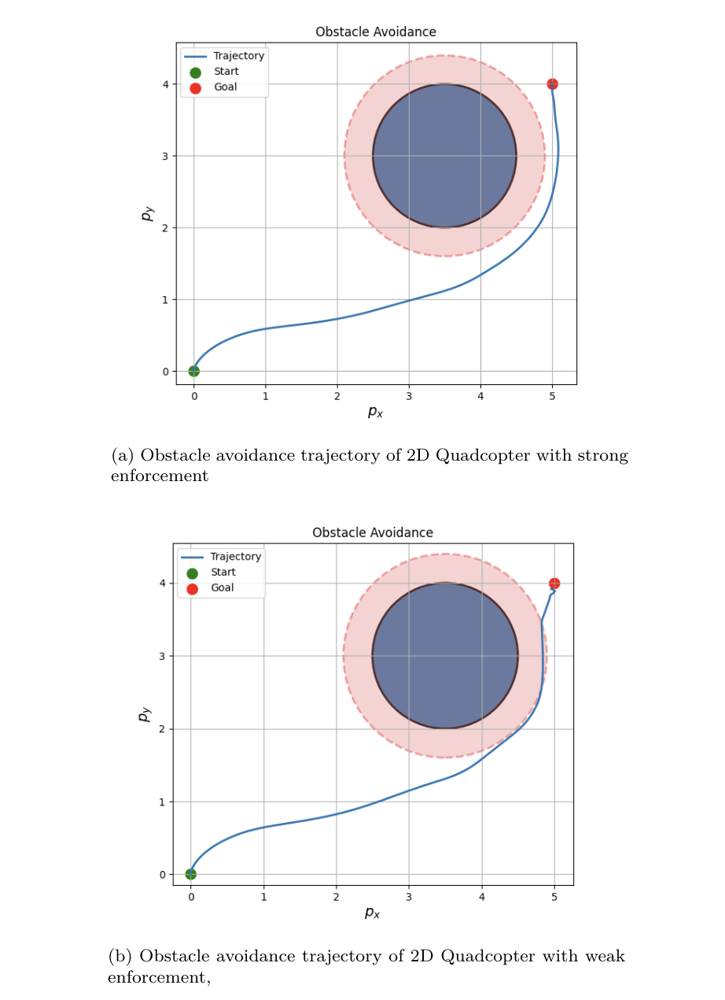
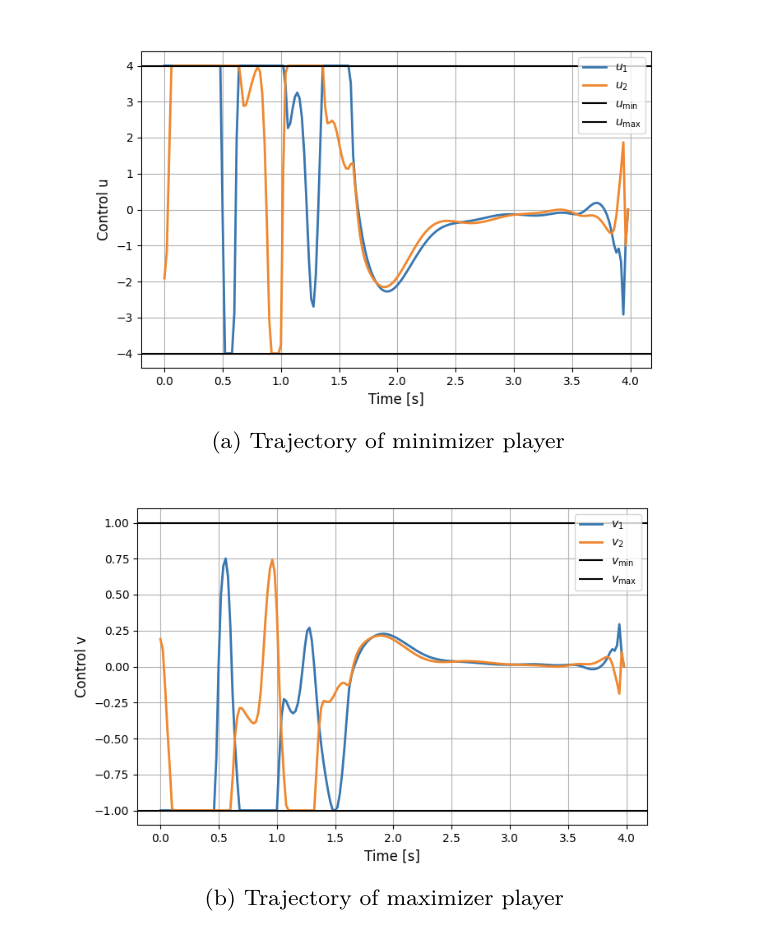
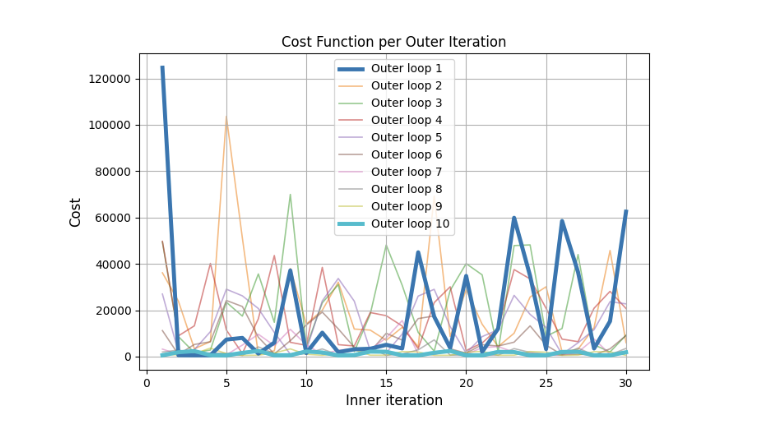
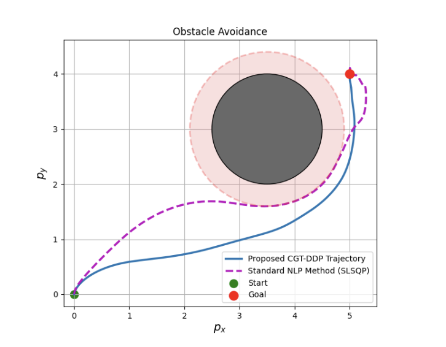

# CGT-DDP — 2D Quadrotor Obstacle Avoidance

Implementation of **Constrained Game-Theoretic Differential Dynamic Programming (CGT-DDP)** applied to a **planar (2D) quadrotor** system navigating around a circular obstacle.

## 📖 Description
A two-player min-max trajectory optimization problem where the quadrotor must reach a desired terminal state while avoiding a circular obstacle. The obstacle-avoidance requirement is enforced as a **functional constraint** through an augmented state z(t), which accumulates the obstacle-violation measure over the trajectory. Point-wise bounds are imposed on both control inputs (−4 ≤ u ≤ 4, −1 ≤ v ≤ 1).

Two enforcement scenarios are demonstrated:
- **Strong enforcement** (outer-loop iterations = 10, α = 0.2) — trajectory remains outside the safety region
- **Weak enforcement** (outer-loop iterations = 5, α = 0.1) — trajectory enters the safety region, showing sensitivity to parameter tuning

## 📊 Results

### Figure 1 — Obstacle Avoidance Trajectory (Strong Enforcement and Weak Enforcement)


### Figure 2 — Trajectories of Control Policies


### Figure 3 — Cost Function for Each Loop


### Figure 4 — Comparison of CGT-DDP and NLP


## 🚀 How to Run
1. Navigate to this folder
2. Run:
```bash
python main.py
```
