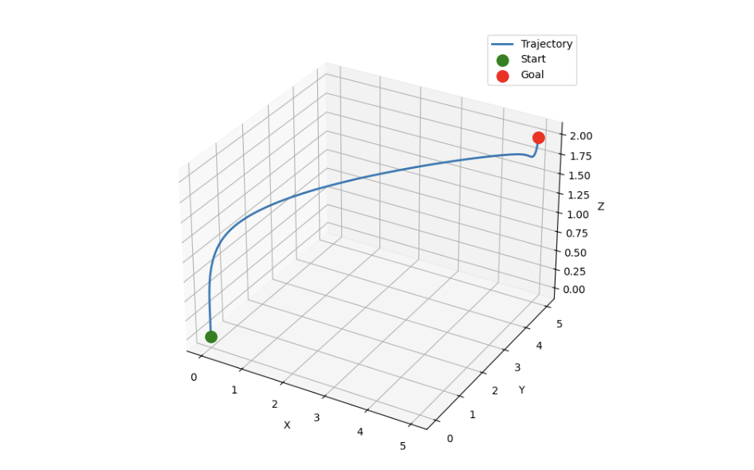
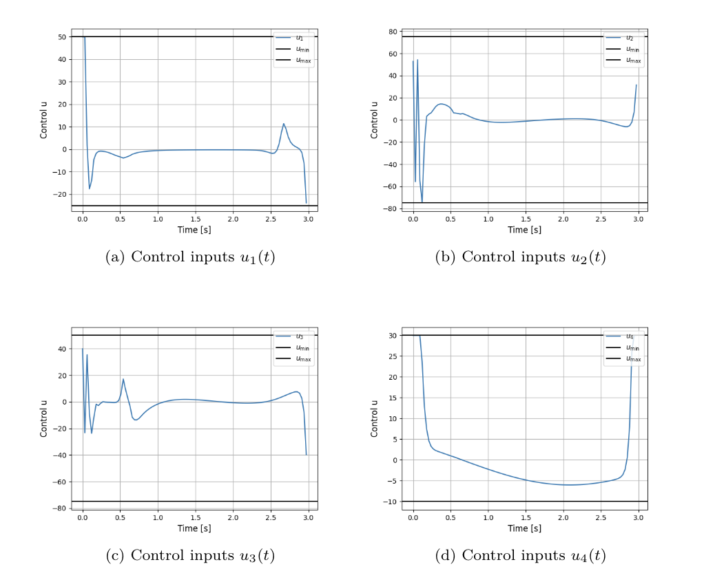
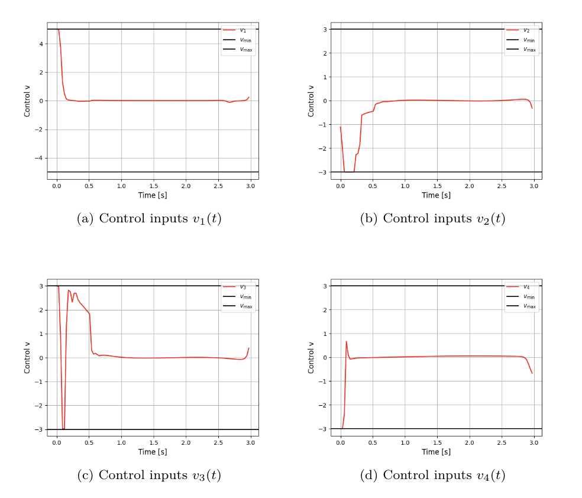
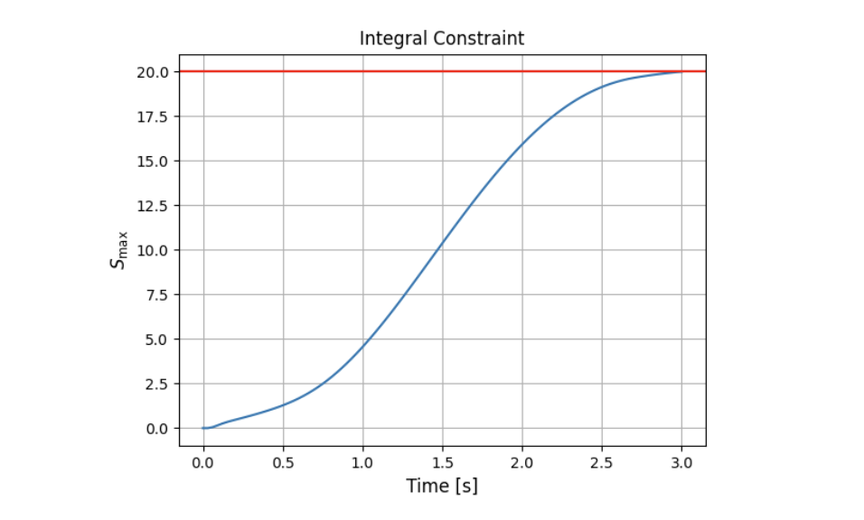

# CGT-DDP — 3D Quadrotor Navigation

Implementation of **Constrained Game-Theoretic Differential Dynamic Programming (CGT-DDP)** applied to a **three-dimensional quadrotor** navigation problem with both functional and point-wise constraints.

## 📖 Description
A two-player min-max navigation problem where the quadrotor must reach a desired 3D terminal position while satisfying:
- A **functional constraint** on the accumulated navigation-path measure (z(T) ≤ 20), enforced via an augmented state
- **Point-wise constraints** on both minimizing and maximizing control inputs throughout the horizon (u: [−100, 100], v: [−50/−30, 50/30])

The quadrotor state includes 12 variables: 3D position, translational velocities, Euler angles, angular rates, and the augmented constraint state.

## 📊 Results

### Figure 1 — Optimized 3D Trajectory


### Figure 2 — Control Histories of Minimizing Player


### Figure 3 — Control Histories of Maximizing Player


### Figure 4 — Integral Constraint Evolution


## 🎥 Video
[▶️ Click here to watch the implementation video](video.mp4)

## 🚀 How to Run
1. Navigate to this folder
2. Run:
```bash
python main.py
```

## 🔗 Related Paper
**Mohammad Sarbaz**, Wei Sun. *Constrained Game Theoretic Trajectory Optimization in Continuous Time.* Journal of Optimization Theory and Applications, 2026.
