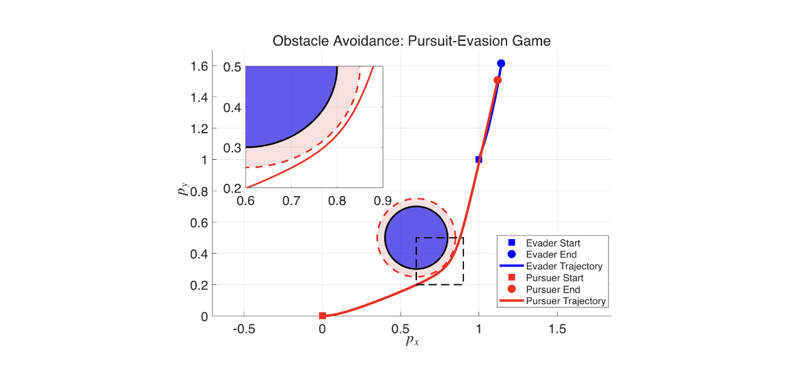
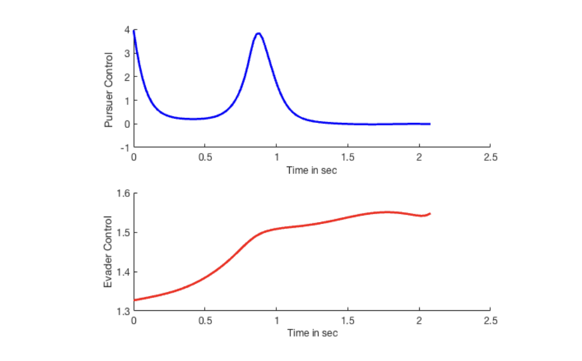
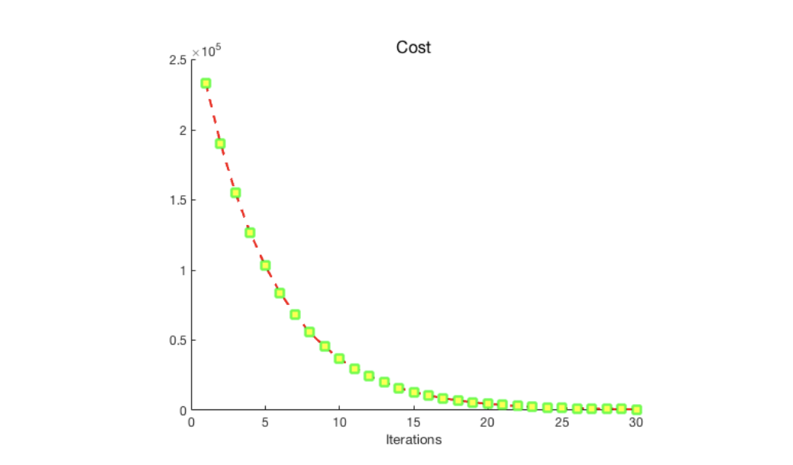

# CGT-DDP — Pursuit-Evasion Game with Obstacle Avoidance

Implementation of **Constrained Game-Theoretic Differential Dynamic Programming (CGT-DDP)** applied to a **two-player pursuit-evasion differential game** with obstacle avoidance.

## 📖 Description
A pursuit-evasion game where:
- The **pursuer** (minimizer) aims to minimize the distance to the evader
- The **evader** (maximizer) aims to maximize this distance and escape
- Both agents must avoid a forbidden circular obstacle region

Obstacle avoidance is enforced as a **functional constraint** through an augmented state z(t), which accumulates the squared obstacle-violation measure over the trajectory (z(T) ≤ 0). The pursuer speed is vp = 1 and evader speed is ve = 0.3. Control inputs are bounded by −4 ≤ u ≤ 4 and −2 ≤ v ≤ 2.

## 📊 Results

### Figure 1 — Pursuit-Evasion Trajectories with Obstacle Avoidance


### Figure 2 — Control Trajectories of Pursuer and Evader


### Figure 3 — Cost Convergence per Iteration


## 🛠️ Requirements
- MATLAB R2020a or later

## 🚀 How to Run
1. Open MATLAB
2. Navigate to this folder
3. Run:
```matlab
main_minimax_PE
```

## 🔗 Related Paper
**Mohammad Sarbaz**, Wei Sun. *Constrained Game Theoretic Trajectory Optimization in Continuous Time.* Journal of Optimization Theory and Applications, 2026.
